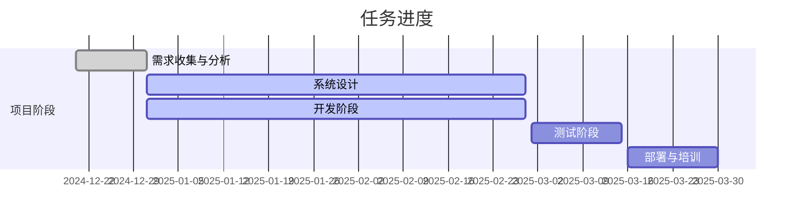
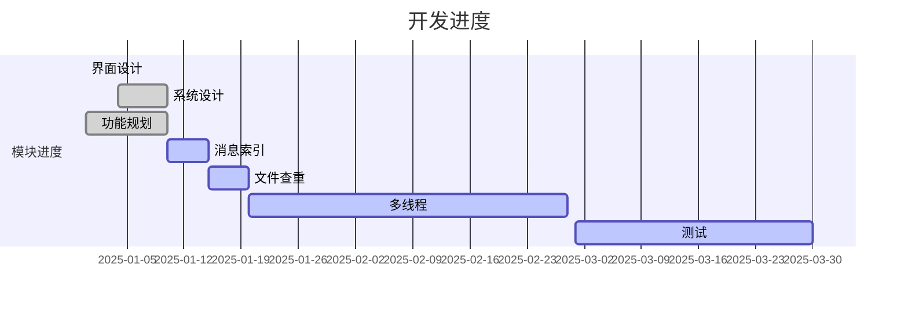

# 需求分析
## ****引言

- **编写目的**：本需求分析文档旨在明确公司内部文件同步工具的需求，以确保开发团队和相关利益相关者对项目目标和功能有一致的理解。
- **项目说明**：该项目旨在开发一个安全、快速、易于使用的文件同步工具，供公司内部员工使用，以提高工作效率和文件管理的便利性。
- **项目背景**：随着公司业务的发展，员工之间的文件共享和协作需求日益增加。现有的文件传输方式存在速度慢、安全性差等问题，因此需要开发一款专门的文件同步工具。
- **项目定义**：该工具将支持多种文件格式的同步，具备版本控制、权限管理和实时更新等功能。

## ****任务概述

- **项目现状**：目前尚未开始开发，已完成初步需求调研。
- **项目目标**：提高文件传输速度确保数据安全性提供用户友好的界面支持多平台（Windows、macOS、Linux）
- **项目任务**：需求收集与分析系统设计开发与测试部署与培训

## ****需求分析

- **用户需求分析**：用户能够方便地使用到该工具。数据自动同步到指定磁盘。
- **业务需求分析**：提高员工之间的协作效率。通过自动化方式完成数据及时传递。
- **功能需求分析**：文件差异、日志记录、数据安全共享等……

## ****附录

- **参考链接**：

​	**tiny-regex-c** : https://github.com/kokke/tiny-regex-c


## 项目进度规划

## ****基本信息

- **项目名称**：公司内部文件同步工具
- **开始日期**：2024年12月20日
- **结束日期**：2025年3月30日
- **负责人**：L

## ****任务列表

```mermaid
gantt  #图标类型图为甘特图
        dateFormat  YYYY-MM-DD   # 设置日期格式 Y年 M月 D日期
        title 这是一个示例甘特图   #甘特图标题 关键字为title
        section 现有任务   #项目关键字，
        已完成               :done,    des1, 2014-01-06,2014-01-08
        进行中               :active,  des2, 2014-01-09, 3d
        计划中               :         des3, after des2, 5d
```

| 任务名称       | 负责人 | 开始日期   | 结束日期   | 状态   |
| -------------- | ------ | ---------- | ---------- | ------ |
| 需求收集与分析 | L      | 2024/12/20 | 2024/12/31 | 已开始 |
| 系统设计       | L      | 2024/12/31 | 2025/02/28 | 已开始 |
| 开发阶段       | L      | 2024/12/31 | 2025/02/28 | 已开始 |
| 测试阶段       | L      | 2025/03/01 | 2025/03/15 | 未开始 |
| 部署与培训     | L      | 2025/03/16 | 2025/03/30 | 未开始 |

## ****进度







## 系统功能汇总


## 1. 文件同步
### 1.1 可能会产生很多碎片  

### 1.2 文件同步的算法  

### 1.3 文件同步的流程
#### 1.3.1 检查文件是否同步(暂时不支持)
#### 1.3.2 文件同步
##### 初版支持本地磁盘同步，后续版本添加web支持

## 2. 功能设计
### 1. 

## 3. 开发进度
### 3.1 程序界面开发
#### 3.1.1 界面设计
采用qt开发，当前进度


